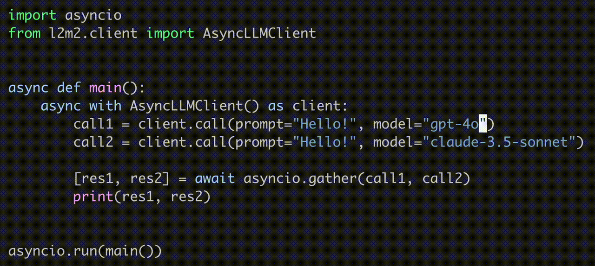

# L2M2: A Simple Python LLM Manager 💬👍

[](https://github.com/pkelaita/l2m2/actions/workflows/tests.yml) [](https://codecov.io/github/pkelaita/l2m2) [](https://badge.fury.io/py/l2m2)

**L2M2** ("LLM Manager" &rarr; "LLMM" &rarr; "L2M2") is a tiny and very simple LLM manager for Python that exposes lots of models through a unified API. This is useful for evaluation, demos, production applications etc. that need to easily be model-agnostic.



### Advantages

- **Simple:** Completely unified interface – just swap out the model name.
- **Tiny:** Only one external dependency (httpx). No BS dependency graph.
- **Private:** Compatible with self-hosted models on your own infrastructure.
- **Fast**: Fully asynchronous and non-blocking if concurrent calls are needed.

### Features

- 30+ regularly updated supported models from popular hosted providers.
- Support for self-hosted models via [Ollama](https://ollama.ai/).
- Manageable chat memory – even across multiple models or with concurrent memory streams.
- JSON mode
- Prompt loading tools

### Supported API-based Models

L2M2 supports <!--start-model-count-->31<!--end-model-count--> models from <!--start-prov-list-->[OpenAI](https://openai.com/api/), [Google](https://ai.google.dev/), [Anthropic](https://www.anthropic.com/api), [Cohere](https://docs.cohere.com/), [Mistral](https://docs.mistral.ai/deployment/laplateforme/overview/), [Groq](https://wow.groq.com/), [Replicate](https://replicate.com/), and [Cerebras](https://inference-docs.cerebras.ai)<!--end-prov-list-->. The full list of supported models can be found [here](docs/supported_models.md).

## Usage ([Full Docs](docs/usage_guide.md))

### Requirements

- Python >= 3.9
- At least one valid API key for a supported provider, or a working Ollama installation ([their docs](https://github.com/ollama/ollama#readme)).

### Installation

```
pip install l2m2
```

### Environment Setup

If you plan to use an API-based model, at least one of the following environment variables is set in order for L2M2 to automatically activate the provider.

| Provider                | Environment Variable  |
| ----------------------- | --------------------- |
| OpenAI                  | `OPENAI_API_KEY`      |
| Anthropic               | `ANTHROPIC_API_KEY`   |
| Cohere                  | `CO_API_KEY`          |
| Google                  | `GOOGLE_API_KEY`      |
| Groq                    | `GROQ_API_KEY`        |
| Replicate               | `REPLICATE_API_TOKEN` |
| Mistral (La Plateforme) | `MISTRAL_API_KEY`     |
| Cerebras                | `CEREBRAS_API_KEY`    |

Otherwise, ensure Ollama is running – by default L2M2 looks for it at `http://localhost:11434`, but this can be configured.

### Basic Usage

```python
from l2m2.client import LLMClient

client = LLMClient()

response = client.call(model="gpt-4o", prompt="Hello world")
print(response)
```

For the full usage guide, including memory, asynchronous usage, local models, JSON mode, and more, see [Usage Guide](docs/usage_guide.md).

## Planned Features

- Streaming responses
- Embeddings
- Other self-hosted providers (GPT4all, LMStudio, etc.)
- Basic tools for common application workflows: RAG, prompt management, search, etc.
- Basic agent & multi-agent system features (a lightweight version of something like [LangGraph](https://www.langchain.com/langgraph) but with stuff I want)
- Support for batch APIs where available (OpenAI, Anthropic, etc.)
- Support for structured outputs where available (Just OpenAI as far as I know)
- ...etc.

## Contributing

Contributions are welcome! Please see the below contribution guide.

- **Requirements**
  - Python >= 3.13
  - [uv](https://docs.astral.sh/uv/getting-started/installation/) >= 0.5.26
  - [GNU Make](https://www.gnu.org/software/make/)
- **Setup**
  - Clone this repository and create a Python virtual environment.
  - Install dependencies: `make init`.
  - Create a feature branch and an [issue](https://github.com/pkelaita/l2m2/issues) with a description of the feature or bug fix.
- **Develop**
  - Run lint, typecheck and tests: `make` (`make lint`, `make typecheck`, and `make test` can also be run individually).
  - Generate test coverage: `make coverage`.
  - If you've updated the supported models, run `make update-docs` to reflect those changes in the README.
- **Integration Test**
  - `cd` into `integration_tests`.
  - Create a `.env` file with your API keys, and copy `itests.example.py` to `itests.py`.
  - Write your integration tests in `itests.py`.
  - Run locally with `python itests.py -l`.
    - _Note: make sure to pass the `-l` flag or else it will look for an L2M2 distribution. Additionally, make sure l2m2 is not installed with pip when running the integration tests locally._
  - Once your changes are ready, from the top-level directory run `make build` to create the distribution and `make itest` to run your integration tests against the distribution.
    - _Note: in order to ensure a clean test environment, `make itest` uninstalls all third-party Python packages before running the tests, so make sure to run `make init` when you're done working on integration tests._
- **Contribute**
  - Create a PR and ping me for a review.
  - Merge!

## Contact

If you have requests, suggestions, or any other questions about l2m2 please shoot me a note at [pierce@kelaita.com](mailto:pierce@kelaita.com), open an issue on [Github](https://github.com/pkelaita/l2m2/issues), or DM me on [Slack](https://join.slack.com/t/genai-collective/shared_invite/zt-285qq7joi-~bqHwFZcNtqntoRmGirAfQ).
